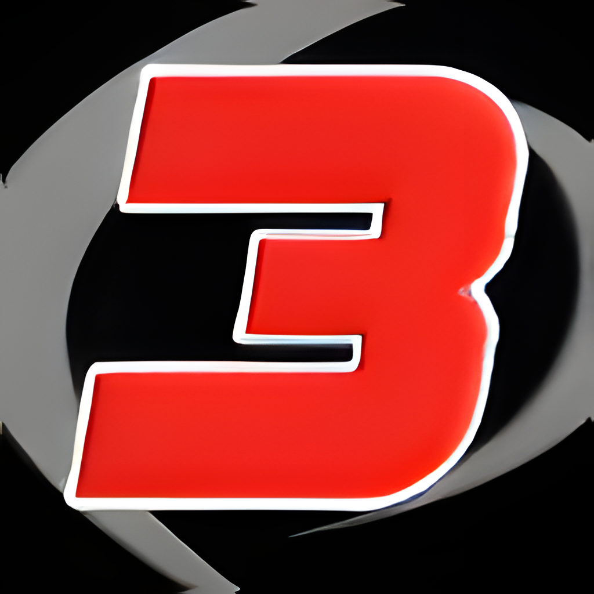

<p align="center">
  
</p>

<h1 align="center">Top Spin 3</h1>

<p align="center">
  Native PC static recompilation of the Xbox 360 version, built on the
  <a href="../README.md">topSpinRecomped</a> framework and ReXGlue.
</p>

## Game

| | |
| --- | --- |
| Developer | PAM Development |
| Publisher | 2K Sports |
| Series | Top Spin |
| Platform recompiled | Xbox 360 |
| Released | June 2008 |
| Genre | Sports, tennis |
| Achievements | 41, 1000 Gamerscore |

## Regions

| Region | Serial | Status |
| --- | --- | --- |
| 🇺🇸 🇪🇺 USA, Europe | `TT-2047` | ✅ Tested (the disc below) |
| 🇯🇵 Japan | `TT-2047` | ⬜ Not tested |

Only the tested disc's `default.xex` has been recompiled. Other regional
executables are likely to differ and may need their own codegen pass.
Region list from [Redump](http://redump.org/discs/system/xbox360/).

## Disc

| | |
| --- | --- |
| Region | 🇺🇸 🇪🇺 USA, Europe |
| Title ID | `545407FF` |
| Media ID | `28AA9C46` |
| Executable version | 0.0.0.1 (built 2008-04-28) |
| Languages | English, French, German, Spanish, Italian |
| Contents | 96 files, 4,264,538,917 bytes |
| Executable | `default.xex`, 4,587,520 bytes |
| DLL modules | None |
| Video format | Bink (`.bik`) |

## Status

| Area | State |
| --- | --- |
| Boot, shader compilation | Working |
| Intro video | Plays |
| Front end | Reached, with the 3D player portrait |
| Stability | No errors in a 90-second debug run |
| Controller input, matches, career | Not yet tested |
| Audio | Initializes; not yet checked by ear |
| DLC | Installer in place (see the [root README](../README.md#dlc)); no packages tested |
| Xbox PC app, UWP builds | Configured, not yet tested |
| Linux, macOS, Steam Deck | Builds expected, not play-tested |

## Play

1. Download `TopSpin3-v<version>-windows-x64.zip` from
   [Releases](https://github.com/furqanagwan/topSpinRecomped/releases?q=topspin3)
   and extract it to a folder you can write to.
2. Run `Top Spin 3.exe` and choose your Xbox 360 ISO (USA/Europe disc, see
   [Regions](#regions)); the files are copied once.
3. Open the system menu with **View + Menu** (or **Esc**) for Settings and Exit.

## System requirements

| | Required |
| --- | --- |
| OS | Windows 10 version 2004 (build 19041) or Windows 11, 64-bit |
| Processor | 64-bit x86 CPU with SSE4.1 |
| Graphics | DirectX 12 GPU (feature level 11_0) |
| Memory | 8 GB RAM recommended |
| Storage | 4.5 GB, plus room for the ISO while it is copied |
| Software | [Microsoft Visual C++ Redistributable 2015-2022 (x64)](https://aka.ms/vs/17/release/vc_redist.x64.exe) |
| Game | Your own Top Spin 3 (USA, Europe) Xbox 360 disc image |

Tested on an Intel Core Ultra 9 275HX, GeForce RTX 5080 Laptop GPU and 32 GB RAM
(Windows 11).

## Build from source

```
rexglue extract "<your disc>.iso" topspin3\assets
.\framework\scripts\build.ps1 -Game topspin3
```

Setup is described in [CONTRIBUTING.md](../CONTRIBUTING.md).

## Default settings

`settings/top_spin_3.toml` starts from the NBA LIVE settings (`rov` / `fsi`
render target paths, no background pipeline creation, 60 Hz vsync). Whether
Top Spin 3 needs each of them has not been tested separately.

## Recompilation notes

| | |
| --- | --- |
| Generated sources | 160 files, about 168 MB |
| Function seeds | 520 in `config/functions.toml` |
| Disabled seeds | 597 in `config/disabled_function_seeds.txt` (they split functions or loops) |
| Jump tables | No under-counted tables |
| Kernel stubs | None needed beyond the framework's |
| Known codegen warnings | Unhandled `vpkd3d128` float16 packs, one 1.5 MB function |

The full log of what was found and fixed is in [docs/NOTES.md](docs/NOTES.md).

## Xbox Developer Mode (UWP)

```powershell
.\framework\scripts\build.ps1 -Game topspin3 -Preset win-amd64-uwp-release
.\framework\scripts\package_uwp.ps1 -Game topspin3 -Register
.\framework\scripts\package_uwp.ps1 -Game topspin3 -Pack
```

## Artwork

`docs/icon.png` is the title image from `default.xex`, upscaled to 1024x1024.
To regenerate the exe icon and Xbox app images locally:

1. `rexglue init --project-name top_spin_3 --xex-path assets\default.xex achievements assets\default.xex metadata`
2. Upscale `metadata/icons/title.png` 4x twice with Real-ESRGAN
   (`realesrgan-x4plus`) to `metadata/gdk_hd/title_1024.png`, or copy
   `docs/icon.png` there.
3. `.\framework\scripts\generate_artwork.ps1 -Game topspin3 -ProjectName top_spin_3`

## Legal

Not affiliated with or endorsed by 2K, Take-Two Interactive or Microsoft. Top Spin
and 2K Sports are trademarks of Take-Two Interactive. You must own the game.
